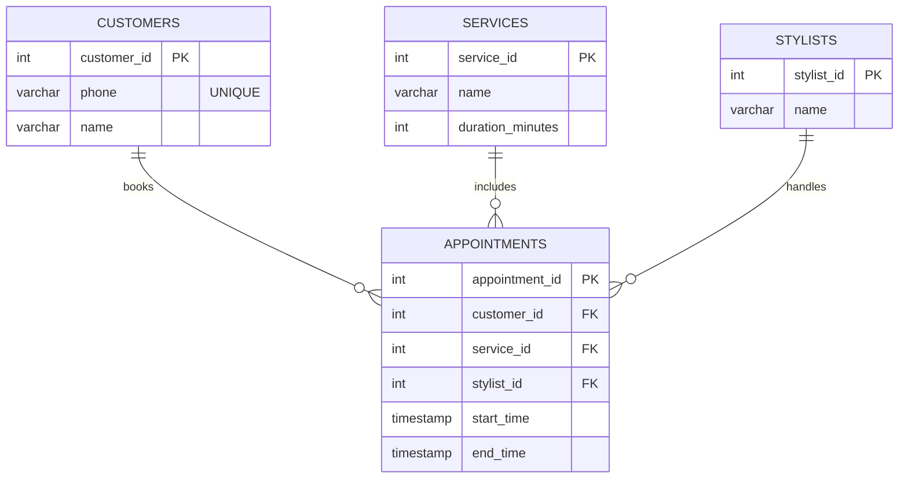

# Analisis dan Peningkatan Integritas Data pada Sistem Booking Salon
## (Studi Kasus: Pengembangan dari Proof of Concept ke Desain Siap Produksi)

## Executive Summary
Proyek ini berawal dari sistem booking salon sederhana berbasis CLI (Bash + PostgreSQL) yang dikembangkan sebagai tugas FreeCodeCamp. Sistem tersebut diperlakukan sebagai Proof of Concept (PoC), lalu dianalisis ulang untuk menilai kesiapan integritas data, konsistensi jadwal, dan desain database sebelum digunakan di lingkungan produksi.

## Desain Sistem
Sistem terdiri dari empat entitas utama:

``customers``

``services``

``stylists``

``appointments``

Tabel appointments berperan sebagai single source of truth untuk seluruh data booking dan ketersediaan waktu stylist.

Durasi layanan disimpan pada tabel services dan digunakan untuk menghitung rentang waktu booking secara dinamis.

## Masalah yang Diidentifikasi

1. Risiko double booking stylist
2. Representasi waktu yang belum aman untuk analisis
3. Sistem PoC belum memiliki mekanisme proteksi konflik di level database

## Solusi Teknis (Design-Level)

1. Menggunakan tipe data waktu berbasis range (tsrange)
2. Menerapkan **EXCLUSION CONSTRAINT** untuk mencegah overlapping appointment
3. Menjadikan database sebagai lapisan proteksi utama terhadap konflik dan race condition

Pendekatan ini menghilangkan kebutuhan tabel availability terpisah dan memastikan konsistensi data secara otomatis.

## SQL & Data Thinking

SQL digunakan tidak hanya untuk CRUD, tetapi sebagai alat:

1. validasi integritas jadwal

2. investigasi konflik

3. audit dan analisis data booking

## Nilai Tambah

Studi kasus ini menunjukkan pendekatan kerja seorang Junior Technical Coordinator yang:

1. memahami batas PoC vs produksi
2. berpikir sistemik
3. memprioritaskan integritas data
4. memilih solusi sederhana namun aman secara teknis


## 🧱 Tech Stack

**PostgreSQL** — database & business logic

**Bash** — command line interface

**PL/pgSQL** — stored procedure

**GitHub Mermaid** — ERD visualization


## 🧠 Design Decisions
### 1️⃣ Appointments as Single Source of Truth
Tidak ada tabel ``stylist_availability``.
Ketersediaan stylist dihitung secara dinamis dari tabel appointments.

Keuntungan:

Tidak ada data redundan

Tidak ada risiko data tidak sinkron

Query lebih sederhana dan aman

### 2️⃣ Double Booking Prevention (Database-Level)
Double booking stylist dicegah menggunakan **PostgreSQL EXCLUDE constraint**:
```
EXCLUDE USING gist (
  stylist_id WITH =,
  tsrange(start_time, end_time) WITH &&
)
```
Artinya:

Stylist yang sama

Tidak boleh memiliki appointment dengan waktu overlap

Dijamin oleh database (race-condition safe)

### 3️⃣ Working Hours Enforcement
Jam operasional salon:

**09:00 – 17:00**

Diatur menggunakan:

1. ``CHECK constraint`` pada tabel
2. Validasi tambahan di stored procedure

### 4️⃣ Service Duration Logic
Durasi layanan disimpan di tabel ``services``:
| Service      | Duration |
| ------------ | -------- |
| Cut          | 30 min   |
| Color        | 60 min   |
| Perm         | 60 min   |
| Full Service | 90 min   |
Durasi aktual bisa berbeda saat konsultasi langsung karena jenis rambut menentukan durasi,
namun sistem menggunakan estimasi awal untuk booking.

### ⚙️ Core Features
**📞 Customer identification by phone number
**
**✂️ Service-based duration handling
**
**👤 Stylist-specific booking
**
**⏱️ Automatic end-time calculation
**
**🚫 Double booking prevention
**
**🕘 Working hours validation
**
**🖥️ CLI-based interaction
**

### 🔁 Booking Flow (High Level)
1. User memilih service
2. User memilih stylist
3. User memilih tanggal
4. Sistem menampilkan slot tersedia (``get_available_slots``)
5. User memilih jam
6. Sistem memanggil ``book_appointment``
7. Database memvalidasi & menyimpan booking

### Database Objects
**Tables:**

1. ``customers``
2. ``services``
3. ``stylists``
4. ``appointments``

**Functions:
**
``get_available_slots``

``book_appointment``

**Constraints:**

Foreign Keys

CHECK (working hours)

EXCLUDE (no overlapping appointments)

## Example Use Case

Customer books Full Service at 15:30

Duration = 90 minutes

End time = 17:00 → valid

Booking at 16:00 → ❌ rejected automatically

## 📈 Possible Improvements

Web / REST API interface

Real-time availability calendar

Dynamic duration after consultation

User roles (admin / stylist)

Analytics dashboard


## ⭐ Closing Note

project ini di bangun dengan chat gpt dan gemini sebagai partner diskusi dan debugging
